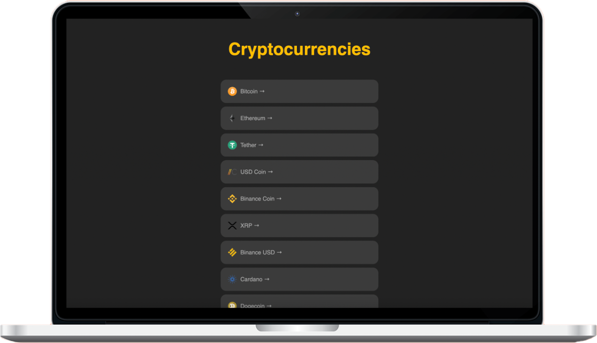
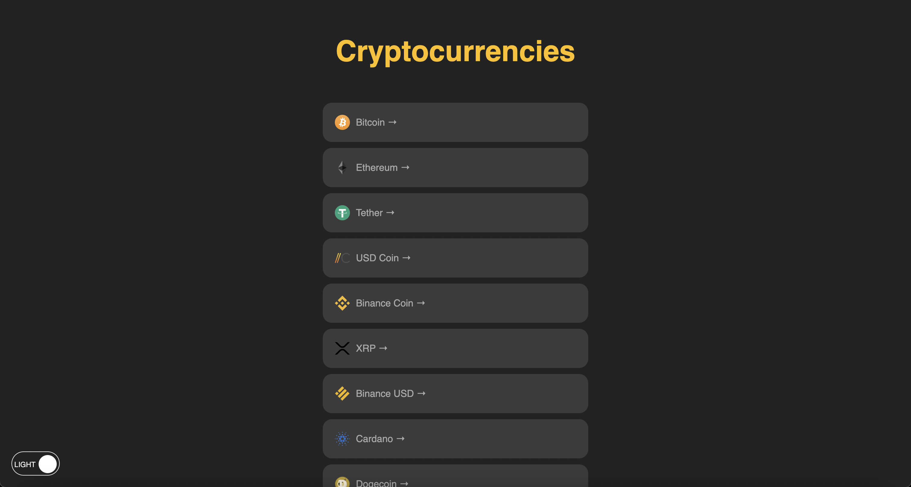
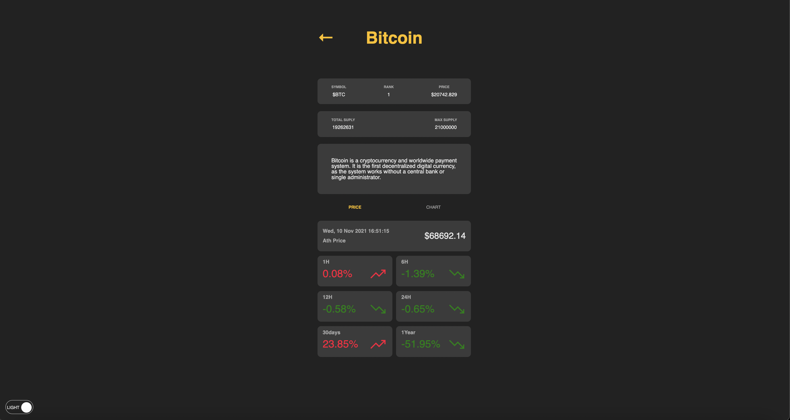
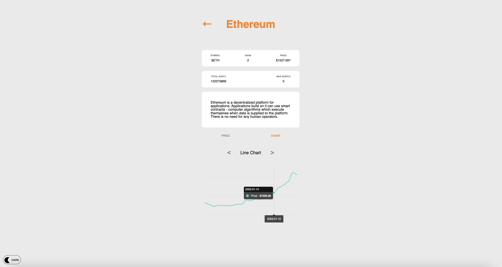

    

        

            

                
            

            

                
            

        

    

    

        

        ABOUT
        

        

        This is a website that allows you to compare information and prices of virtual currencies through a virtual currency API. It has been implemented to easily compare values through graphs using apexcharts.
        

        

            
<a href="https://github.com/WonWonGit/coin-tracker" target='_blank'>CODE</a>

            

                <a href="https://wonwongit.github.io/coin-tracker/" target='_blank'>TRY</a>
            

        

    

## Images

## Details

### Members

2

### Duration

1month

## Stacks

   

        <ul class="stacksList">
            <li>React</li>
            <li>React-Query</li>
            <li>Styled-component</li>
            <li>apexcharts</li>
        </ul>
    

   
 

## What I focus on

I have always been concerned about how to separate client logic and server logic while using React. To improve this problem, I wanted to use React-Query to separate client and server logic, making it more intuitive and easy to manage in the future.
