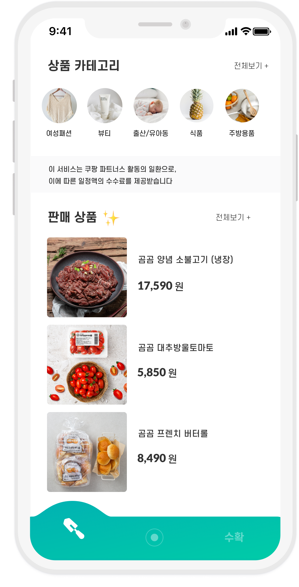
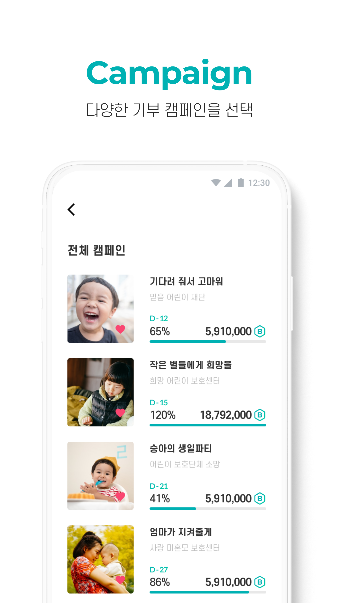
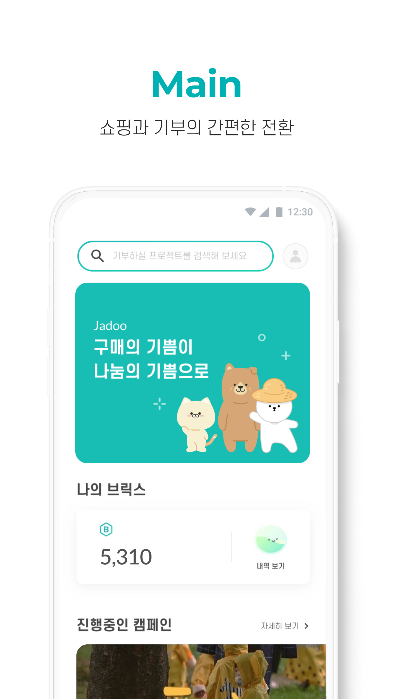

    

    

    

    
    

    

    
    

    

    

    

    

    ABOUT
    

    

    An app that lets you buy products and subscribe to magazines by earning points. You can earn points by doing things like tracking your steps and playing games. The app also has campaigns that let you donate your skills to help others and build a community. It's designed to help improve your overall lifestyle.
    

    

## Images

## Details

### Members

Server : 3

Front : 2

Application : 4

Design : 3

### Duration

7month

## Stacks

   

        <ul class="stacksList">
            <li>Next JS</li>
            <li>SCSS</li>
            <li>MobX</li>
            <li>Axios</li>
        </ul>
    

    

        <ul class="stacksList">
            <li>TypeScript</li>
            <li>Swagger</li>
            <li>Github</li>
            <li>Figma</li>
        </ul>
        

   
 

## What I focus on

As an admin website, my primary goal was to provide a user-friendly interface that allows for easy monitoring of user and app-related information. A key feature of the website is the dashboard, which provides an overview of key metrics such as sales, points, and users, allowing for quick and easy analysis of important data.
To ensure the security and integrity of the platform, I implemented various measures such as maintaining secure login sessions, managing access tokens, and implementing strict security protocols throughout the front-end. Additionally, I took great care in ensuring that the overall design and functionality of the website is professional and meets the needs of the admin user.
