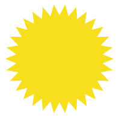
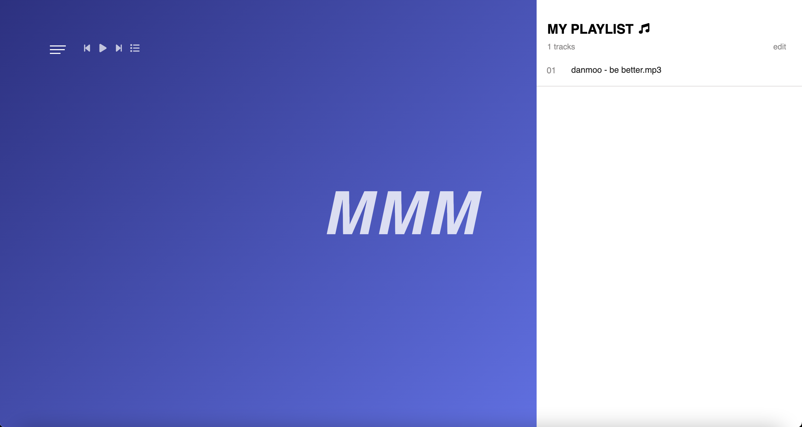
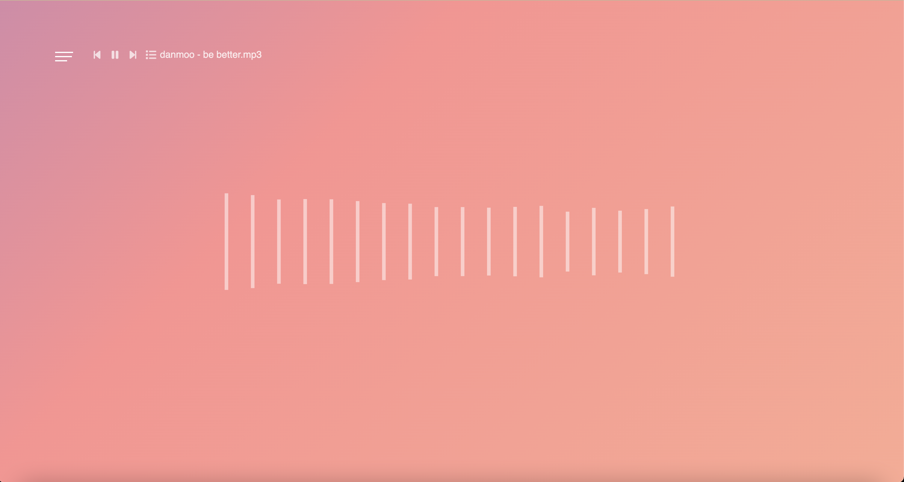

    

        

            

                
            

            

                
            

        

    

    

        

        ABOUT
        

        

        This is a toy project I worked on after finishing a JavaScript group study. The website, called "MMM" uses audio visualization to display visual effects on the screen based on the frequency of music. I used an indexedDB web storage to store mp3 files in blob form without any problems. I also implemented audio web API to enable users to control the music, such as playing and pausing.
        

        

            
<a href="https://github.com/WonWonGit/mmm" target='_blank'>CODE</a>

            

                <a href="https://wonwongit.github.io/mmm/html/index.html" target='_blank'>TRY</a>
            

        

    

## Images

## Details

### Members

2

### Duration

1month

## Stacks

   

        <ul class="stacksList">
            <li>HTML</li>
            <li>Javascript</li>
            <li>CSS</li>
            <li>Indexed DB</li>
        </ul>
    

   
 

## Focus / Goal

I have always been interested in learning more about the canvas element in HTML. During a JavaScript group study, I focused on creating visually pleasing websites using a combination of HTML and vanilla JS. I also paid attention to controlling animations to draw models on canvas one by one and handling synchronous processing.

<!-- ## Blog Posts

During this project I made few posts about what I learned.

 
  -->
