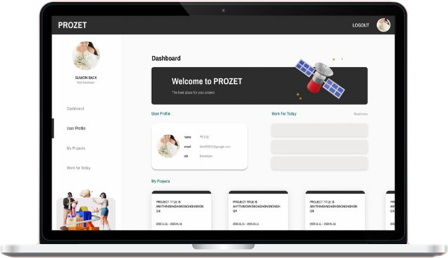
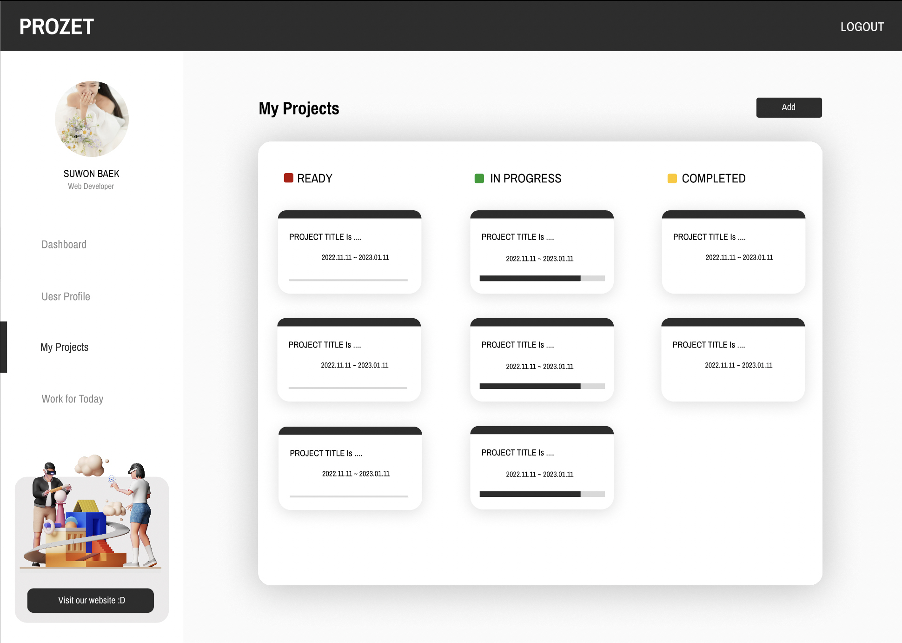
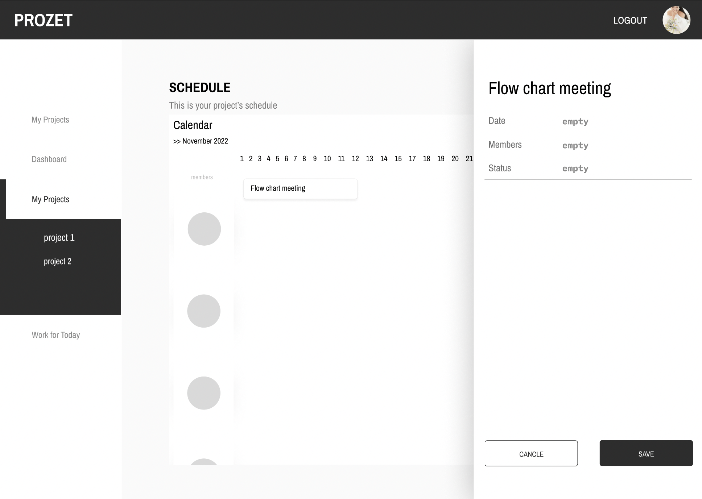
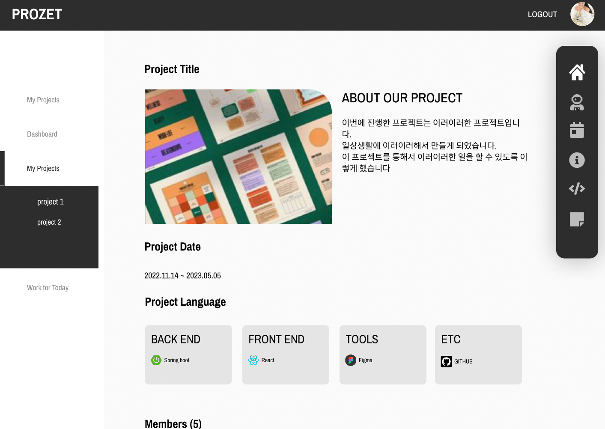

    

    

    

    
    

    

    
    

    

    

    

    

    ABOUT
    

    

    I have always faced difficulties when working on side projects with team members, such as keeping track of progress and documenting the project after completion. I want to create a website that can solve these problems. Currently, I am working on implementing a server that allows for easy project management through features such as basic project information, member invitations, and schedule management. Additionally, I am planning to implement a feature that allows users to export project-related content in the form of a PDF file using design templates. This will make it easy for project members to use for creating a resume or portfolio in the future.
    

    

        
<a href="https://github.com/WonWonGit/prozet_backend_new" target='_blank'>CODE</a>

    

    

## Images

## Details

### Members

1

### Duration

2022.12.01 ~ ing

## Stacks

   

        <ul class="stacksList">
            <li>Spring boot</li>
            <li>Java 11</li>
            <li>Gradle</li>
            <li>Spring Security</li>
            <li>JWT</li>
        </ul>
    

    

        <ul class="stacksList">
            <li>smtp Mail</li>
            <li>Query DSL</li>
            <li>JPA</li>
            <li>Redis / MySQL</li>
            <li>JUnit5</li>
        </ul>
    

    

        <ul class="stacksList">
            <li>React</li>
            <li>Styled-components</li>
            <li>Recoil</li>
            <li>Styled book
            <li>Monorepo</li>
        </ul>
    

    

        <ul class="stacksList">
            <li>Github</li>
            <li>Figma</li>
            <li>AWS</li>
            <li>S3 Bucket</li>
        </ul>
   
 
   
 

## What I focus on

Even though I am working on this project alone, I am focusing on writing test codes for future version management. Additionally, I am planning to use swagger for server documentation and a style book for front-end documentation to ensure clear documentation. Currently, I believe the server is about 70% completed. Regarding the front-end structure, to maintain consistency in style, I have implemented a monorepo structure.

## Blog Posts

Here are some things I learned and posted about during this project:

 
 

<a href="https://medium.com/@bkn020612/redis-e74540904320" target='_blank'>👉🏻 Redis</a>

 
 

<a href="https://medium.com/@bkn020612/junit-repository-test-420c19ee1e0f" target='_blank'>👉🏻 JUnit Repository Test</a>

 
 

<a href="https://medium.com/@bkn020612/junit-service-test-feat-mockito-8fbf4f455092" target='_blank'>👉🏻 JUnit Service Test (Feat. Mockito)</a>

 
 

<a href="https://medium.com/@bkn020612/set-apart-test-env-and-dev-env-7f9703f94a04" target='_blank'>👉🏻 Separate Test env and Dev env</a>
