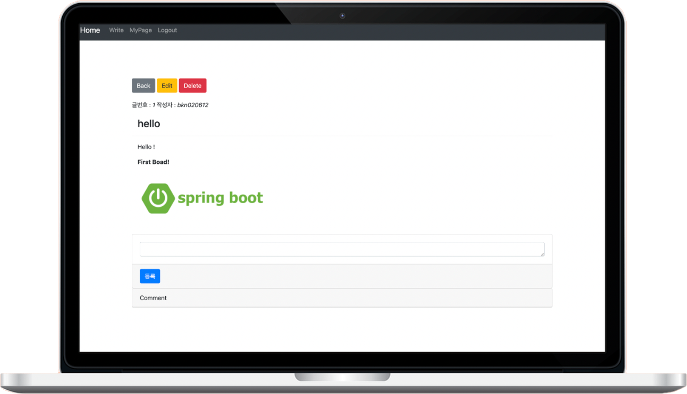
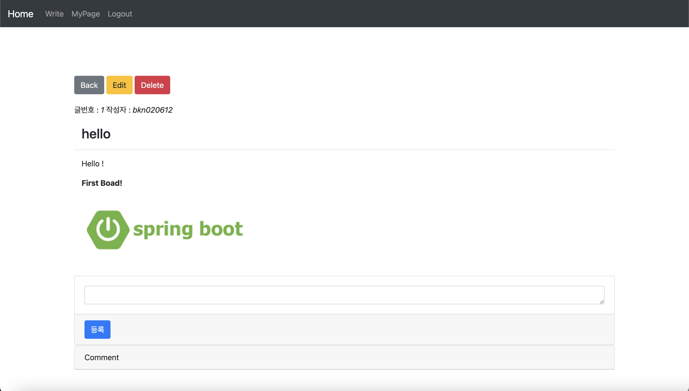
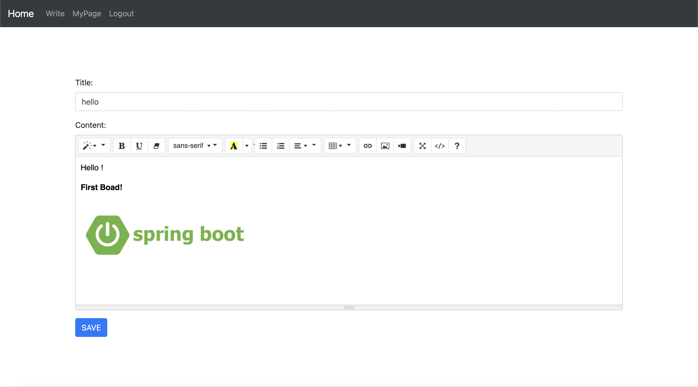
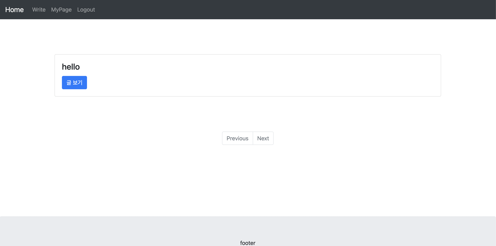

    

        

            

                
            

            

                
            

        

    

    

        

        ABOUT
        

        

       I created a bulletin board website using Spring Boot to gain a comprehensive understanding of JPA and Spring Security. The website includes basic bulletin board functionality such as registering, deleting, and editing posts, as well as commenting and social login. I also implemented the Summernote editor to allow users to write posts in a variety of formats.
        

        

            
<a href="https://github.com/WonWonGit/blog" target='_blank'>CODE</a>

        

    

## Images

## Details

### Members

1

### Duration

3days

## Stacks

   

        <ul class="stacksList">
            <li>Spring Boot</li>
            <li>Javascript</li>
            <li>Spring OAuth2.0</li>
            <li>Thymeleaf</li>
        </ul>
    

    

        <ul class="stacksList">
            <li>maven</li>
            <li>h2-console</li>
        </ul>
    

   
 

## What I focus / goal

I aimed to grasp basic JPA syntax and concepts by creating this project. Additionally, I used Spring OAuth2.0 to improve my understanding of security-related concepts.

## Blog Posts

During this project I made few posts about what I learned.

 
 

<a href="https://medium.com/@bkn020612/what-is-spring-security-fafd919f1dfb" target='_blank'>👉🏻 What is Spring Security</a>

 
 

<a href="https://medium.com/@bkn020612/how-to-set-up-spring-security-f2d3486b9a89" target='_blank'>👉🏻 How to set up Spring Security?</a>

 
 

<a href="https://medium.com/@bkn020612/access-control-with-spring-security-feaabddbfeac" target='_blank'>👉🏻 Access control with Spring Security</a>
