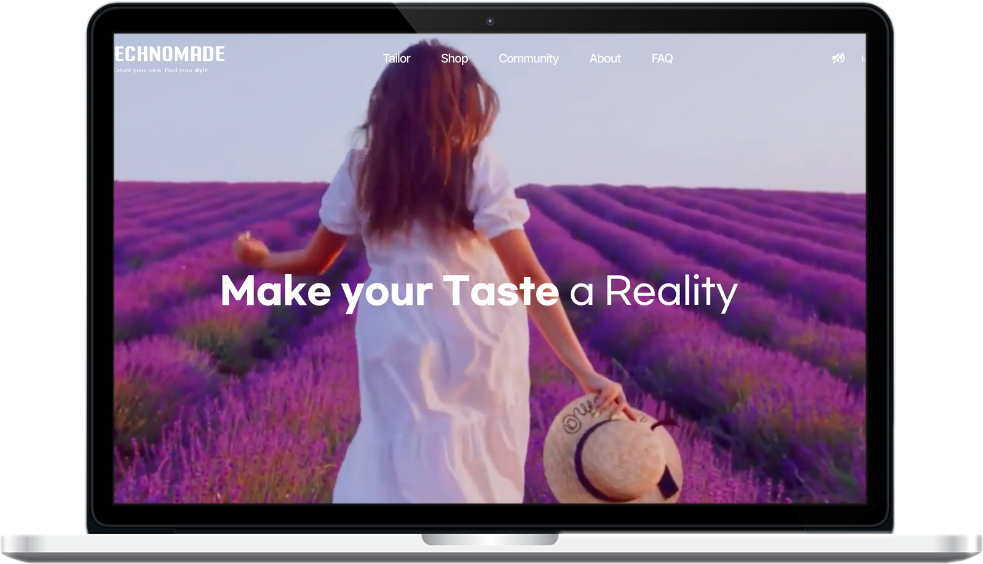
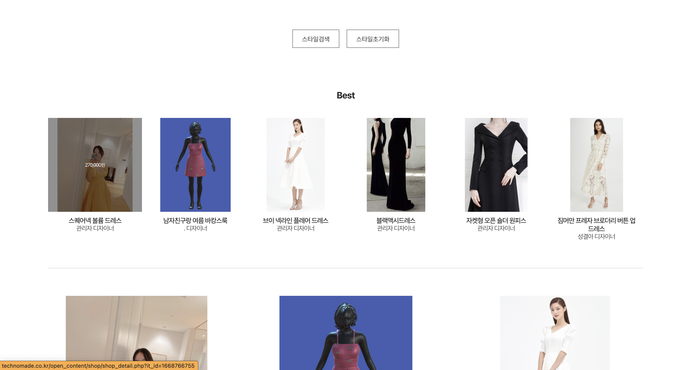
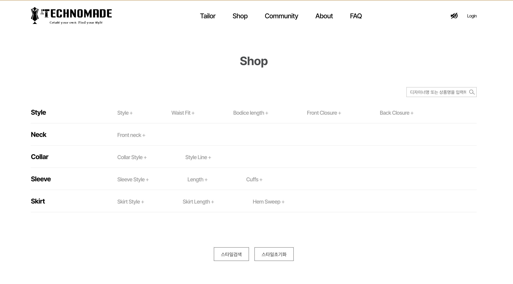

    

    

    

    
    

    

    
    

    

    

    

    

    ABOUT
    

    

     A website for shopping that allows customization to fit one's measurements through AR. Not only can it be registered as a private business for selling, but also allows for purchasing. With simple membership registration through social login, the main focus is on customization, allowing for detailed searches of individual measurements, style, clothing material, and even the shape of the collar, enabling users to find the desired clothing.
     

    

## Images

## Details

### Members

Server : 5

Designer : 2

FrontEnd : 2

### Duration

6month

## Stacks

   

        <ul class="stacksList">
            <li>Spring boot</li>
            <li>Java 11</li>
            <li>Gradle</li>
            <li>Spring Security</li>
            <li>Spring OAuth</li>
        </ul>
    

    

        <ul class="stacksList">
            <li>Thymeleaf</li>
            <li>Query DSL</li>
            <li>JPA</li>
            <li>AWS</li>
            <li>HTML / CSS / JavaScript</li>
        </ul>
    

    

        <ul class="stacksList">
            <li>Maria DB</li>
            <li>Slack</li>
            <li>Github</li>
        </ul>
    

## What I focus on

In my first project at the company, I put in effort to align with the existing code style and format used by the company. Since we were working as a team, I paid extra attention to naming conventions. My specific role in the project was to implement customer experience, including a "like" button, ranking system, and search filters for clothing attributes such as material and fit. The filtering process required a lot of attention to detail, so I focused on making it as efficient as possible and anticipating user actions to prevent errors in the code.
